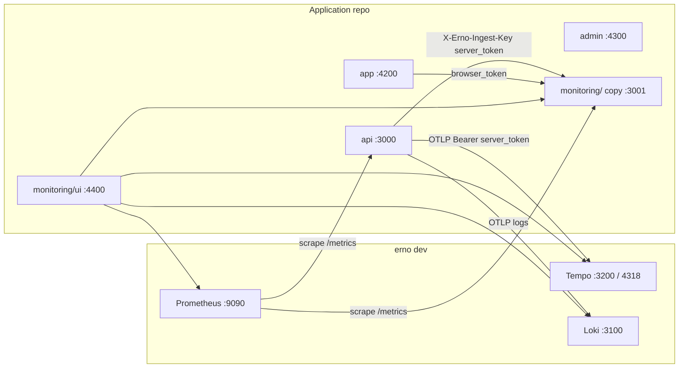
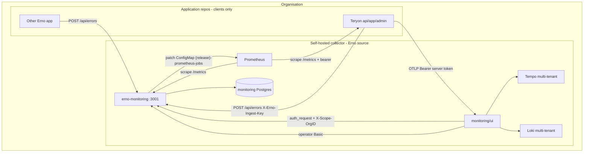
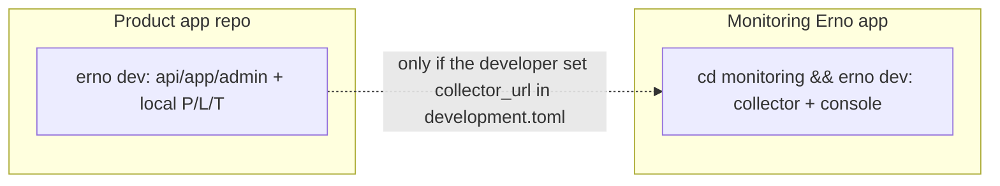
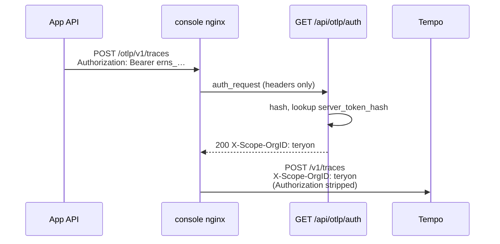

# Multi-app self-hosted monitoring for Erno

| | |
|---|---|
| **Author** | TBD |
| **Date** | 2026-08-27 |
| **Status** | Implemented, with five decisions overridden — see below |
| **Audience** | Erno maintainers |

:::caution[Read this as a record, not as documentation]
Every PR in the plan at the end is merged. The reasoning here still holds and
the rejected alternatives are still worth knowing, but five decisions were made
differently once the code existed, so parts of this document describe a design
that was not built. **The narrative docs under `docs/src/content/docs/monitoring/`
are the current truth.**

What changed, and why:

1. **The collector moved to its own repository** (`erno-monitoring`), rather than
   staying in this one as the Overview and Goals say. What the document called a
   separate deployment was true of the process and of nothing else: the
   collector's 10,700 lines lived in `api/src/error_reporting/collector/`, inside
   the library every application links, and `monitoring/` was a 106-line shell
   around them. Moving the code out first made the repository split a move rather
   than an untangling.

2. **A third crate holds the wire contract.** `erno-error-reporting-types` carries
   `Source`, `Level`, `Frame`, `CapturedError`, the ingest headers and
   `is_in_app` — what both halves must agree on. The document assumed one repo,
   so it never needed one.

3. **The collector is laid out as an ordinary Erno application** — collector in
   `api/`, console in `app/` — so `erno dev` runs it with no special case. Key
   Decision 9's flat layout and its `handle_dev` branch were only necessary while
   the collector was a subdirectory of this repository.

4. **`erno deploy --target` is gone.** Key Decision 8 and PR 7 assume a flag
   choosing between an application and a monitoring tree, and a `production.images`
   mechanism for a standalone ops repo. Neither survived the split: the collector
   deploys from its own repository, which builds its own images, and the tree
   already says which it is — only the collector's `api/config/*.toml` declares
   `[collector]`. A flag that must agree with the repository you are standing in
   is a way to deploy the wrong chart into the wrong cluster.

5. **`erno dev` no longer starts Prometheus, Tempo or Loki.** Key Decision 9 kept
   them local for every application "so the TUI WIRE/logs views keep working".
   Once the collector was a separate repository, requiring three telemetry
   binaries on every product developer's `PATH` — a missing one being a hard
   error — bought a dashboard for a collector that was not there. They are now
   declared as components of the monitoring application in erno-monitoring's
   `erno.toml`, which is what a backend of the collector is. The TUI panes they
   fed (the trace waterfall, the p95/error header, the route table) were removed
   rather than left rendering zeros; the monitoring console presents the same
   data against the same stores.
:::

## Overview

Erno currently treats monitoring as part of each application. `erno new` copies `monitoring/` into the generated tree, rewrites a workspace `Cargo.toml` that cannot parse outside this monorepo, and `erno dev` starts a collector, console, Prometheus, Loki and Tempo beside that one app. Two global ingest tokens in `[collector]` authenticate every reporter. `Source` (`Api | App | Admin`) is the component of that one product, not which product.

This design stops copying. The collector stays in the Erno repository (and is published as a container image). An organisation runs **one** self-hosted collector. Every Erno app of that organisation is a **project** — a row, a pair of ingest tokens, a scrape target, its own uptime checks, alert rules and status page. Apps hold `collector_url` + `ingest_token` on the API and a public browser token in the Angular bundle. They never contain a `monitoring/` directory.

This is not Erno-as-SaaS. Tenancy is "several apps, one company", not "every Erno user on earth". Pre-1.0: no compatibility with copied `monitoring/` trees. Existing copies (Teryon) are deleted and pointed at the shared collector.

## Background & Motivation

### What broke

A brand-new app (`erno new teryon` then `erno dev`) failed in two independent ways:

1. **Unparseable collector manifest.** `copy_monitoring` in `cli/src/commands/new.rs` copies `monitoring/` and only rewrites the `erno = { path = "..." }` line (`rewrite_monitoring_manifest`). The rest of `monitoring/Cargo.toml` still says `edition.workspace = true` and `{ workspace = true }` for every other crate. Cargo cannot parse that file outside the Erno workspace.

2. **Doubled Prometheus/Loki/Tempo paths.** `handle_new` calls `handle_dev(Some(dest))` with `dest = PathBuf::from(name)` — a relative path. `spawn_labeled` in `cli/src/commands/dev/process.rs` sets `current_dir` to `.erno/prometheus` (etc.). The spawn args are still relative (`--config.file=teryon/.erno/prometheus/prometheus.yml`), so the child, already inside that directory, looks for the config one extra `teryon/.erno/prometheus/` down.

Flattening the copied `Cargo.toml`, or wrapping every generated app as a Cargo workspace, would paper over (1) and leave a collector inside every application repository. That was rejected. The relative-path bug is real regardless of copying and is the independent first PR.

### Current architecture (as of this writing)



Facts that constrain the redesign:

| Fact | Where |
|---|---|
| Collector is an ordinary Erno app: `boot::<MonitorMigrator, MonitorConfig>` mounts `collector_router` | `monitoring/src/main.rs` |
| Collector logic lives in the library, not the binary | `api/src/error_reporting/collector/` |
| Collector migrations are **not** in `erno_migrations()` | `api/src/error_reporting/collector/migrations/mod.rs` |
| `Source` is `Api \| App \| Admin`. Trust and the allowed Source set come from which credential matched; `x-erno-source` is honoured only inside that set (server: any, default Api; browser: Admin or App, never Api) | `api/src/error_reporting/mod.rs`, `collector/auth.rs` |
| Two global tokens in `[collector]`: `server_token`, `browser_token`. Header `X-Erno-Ingest-Key` | `CollectorConfig`, `INGEST_KEY_HEADER` |
| Browser token is public by design. Attribution from browsers is discarded | `auth.rs` comments; docs |
| Fingerprint unique index `uq-error_issue-fingerprint` is the upsert conflict target | `m20260823_090000_create_error_issue.rs`, `ingest.rs` `ON CONFLICT (fingerprint)` |
| Unique indexes that are global today: fingerprint, `app_health.instance`, `release (version, environment)`, `uptime_check.name`, `alert_rule.name` | collector migrations |
| OTLP: nginx `auth_request`s `GET /api/otlp/auth`, then proxies to Tempo :4318 / Loki :3100. Tempo and Loki have no auth of their own | `cli/templates/deploy/monitoring/ui/docker/nginx.conf` |
| Production Prometheus has **one** scrape target: `production.scrape.target`, plus the collector's own `/metrics` | `cli/src/deploy/render.rs` `prometheus_yml` |
| `erno deploy init --target monitoring` requires `api/Cargo.toml`, `app/package.json` **and** `monitoring/Cargo.toml` | `cli/src/deploy/project.rs` `validate_project_root` |
| Docker build context is `./monitoring`, which only works because `erno new` rewrites the `erno` path/git dep. `edition.workspace = true` is the leftover that still breaks | `cli/templates/deploy/github/workflows/monitoring.yaml`, `monitoring/Dockerfile` |
| When the collector is down, reporters buffer a bounded queue then drop. Nothing blocks | `ErrorReportingConfig.queue_capacity`, reporter `sender.rs` |
| Operator login is HTTP Basic against the monitoring deployment's `[admin]`, independent of any application's auth | `operator.rs` `require_operator` |

### Pain points this design removes

- Generated apps cannot `cargo check` the copied collector.
- Every app ships a second Rust crate, a second Angular app, a second Postgres, a second Kubernetes release.
- Two tokens are organisation-global: rotating Teryon's browser token would rotate Cubeast's.
- CORS origins, scrape target, status page name, alert recipient are all single-valued in config.
- `erno deploy init --target monitoring` cannot be run except from an application tree that contains a copy of `monitoring/`.
- Local `erno dev` starts a collector the developer did not ask for, on a database `erno new` may have failed to make usable.

## Goals & Non-Goals

### Goals

- One self-hosted collector per organisation, source in the Erno repository and/or a published image.
- A **project** is one Erno application. `Source` remains the component inside a project.
- Generated apps are clients only: no `monitoring/` directory, no monitoring databases.
- Per-project server token, browser token, CORS origins, scrape target, uptime, alerts, status page, retention.
- Console: project switcher and an all-projects view. One operator user for v1.
- `erno new` stops copying. `erno deploy init --target monitoring` does not assume an application repo.
- Local `erno dev` for a **product** app does not start `[mon]` / `[console]`. Reporting is **off** in generated development.toml. The collector is a separate Erno app: `cd monitoring && erno dev` in its own tree. Local Prometheus/Loki/Tempo **for that product app** stay, so the TUI WIRE/logs views keep working.
- Independent first PR: absolute paths for Prometheus/Loki/Tempo config, fixing `erno new` → `erno dev` even before copying stops.

### Non-goals

- Hosted Erno-as-SaaS (one collector for every Erno user on earth).
- Flattening or workspace-wrapping copied `monitoring/Cargo.toml`.
- Per-project operator accounts / RBAC. One HTTP Basic user for v1.
- Migrating existing copied collector databases in place. Pre-1.0: delete and re-point.
- Browser RUM, Grafana, changing the reporter's "buffer then drop" contract.
- Making local product-app `erno dev` Tempo/Loki the organisation collector. They stay per-app, for the developer sitting at that laptop.
- An `erno monitoring up` supervisor, or any CLI that starts the collector as a child of a product app.
- Per-project alert email (`project.alert_email`). Org-level `[collector.alerts] recipient` only.
- Backwards compatibility with `[collector] server_token` / `browser_token` in config, or with the current operator URL shapes.

## Key Decisions

1. **One collector per organisation, never per app.** Isolation that matters is failure-domain isolation from the apps being watched (`docs/src/content/docs/monitoring/index.md`), not isolation between Teryon and the next app the same company ships. Running N collector deployments would preserve today's two-token simplicity at the cost of N databases, N Prometheus, N TLS certs, N "is monitoring itself up?" questions.

2. **A project is an application; `Source` stays a component.** `Source::Api | App | Admin` is "which process of this product crashed". Trust and the allowed Source set come from which token hash matched; `x-erno-source` is honoured only inside that set (unchanged from `auth.rs`: server may declare any source, default Api; browser may declare Admin else App, never Api). Do not start ignoring the header. Namespacing issues, health rows, and scrape jobs by project is a new axis, not a reuse of `Source`. Fingerprints already start with `source.as_str()` (`fingerprint.rs`); they will also start with `project_id`.

3. **Stop copying. Do not flatten.** The generated app is not a Cargo workspace and will not become one to host a crate that does not belong there. `copy_monitoring` / `rewrite_monitoring_manifest` / `rewrite_monitoring_config` go away.

4. **Tokens live in the project row, stored as SHA-256 hex, looked up by hash.** Today's constant-time compare against two config strings does not scale to N projects. `crate::token::hash_token` already exists for this. Plaintext is shown once at create/rotate.

5. **Registration is explicit: `erno monitoring add`, with the console as a second client of the same operator API.** First-deploy auto-registration is rejected: local development needs a project before production exists, and tokens have to land in the app's config and SOPS by a human-visible step. Silent creation on first ingest is rejected: a typo'd URL would mint junk projects.

6. **Production Tempo and Loki become multi-tenant via `X-Scope-OrgID` = project slug, and the slug is immutable after insert.** nginx cannot inject OTLP resource attributes into a protobuf body. Grafana's native tenant header can be set from `GET /api/otlp/auth`. The collector's own in-cluster OTLP (today `APP__TRACING__OTEL__ENDPOINT=http://{release}-tempo:4318` in `cli/src/deploy/render.rs`, never through nginx) must send the same header for the seeded `monitoring` tenant, or those pushes are rejected once `multitenancy_enabled` / Loki `auth_enabled` are on. Local `erno dev` Tempo/Loki stay single-tenant (they are not the org collector). Pre-1.0: wipe existing volumes. PATCH cannot rename a slug; DELETE does not reap Tempo/Loki tenants.

7. **Production Prometheus stays on 2.55.1. The collector renders one scrape job per project** (each with `authorization.credentials`), not HTTP SD and not `__header_Authorization` (that relabel landed in Prometheus 3.x; the bundled image is `prom/prometheus:v2.55.1`). Jobs reach Prometheus by **patching a Kubernetes ConfigMap** (`{release}-prometheus-jobs`) that the Prometheus pod mounts — not an `emptyDir`, which is pod-scoped and cannot be shared by the collector Deployment and the Prometheus Deployment (`cli/src/deploy/render.rs` `collector_deployment` vs `prometheus()`). **The collector does not POST `/-/reload`.** A sidecar **in the Prometheus pod** watches `/etc/prometheus/generated` and reloads **after** the file on disk changes (kubelet ConfigMap sync can take a minute; Prometheus 2.55 only re-reads `scrape_config_files` on start and on reload; a 200 from `/-/reload` against the previous `jobs.yml` is not a failure). Prometheus args include `--web.enable-lifecycle`. The collector's own `/metrics` remains a static job in the chart's base config. Do not bump Prometheus to 3.x in this work.

8. **`erno deploy init --target monitoring` runs against a monitoring tree or an empty ops repo, never against an application repo.** Images are published from **this** monorepo (`ghcr.io/${{ github.repository }}/monitoring`); init fills `production.images` from that, or requires the operator to set them. The organisation does not rebuild the collector from a vendored copy of `monitoring/`.

9. **Monitoring is a separate Erno app. Product `erno dev` never starts it. There is no `erno monitoring up`.** Generated apps have reporting **off** (`collector_url` empty). To run the collector locally: `cd monitoring && erno dev` in the Erno checkout (or a standalone monitoring checkout). To send a product app's dev errors there, the developer **edits that app's `development.toml` themselves**. `erno monitoring add` does not write `development.toml`. Local product Prometheus/Loki/Tempo stay so the TUI still has WIRE/logs. Fingerprints still ignore `environment`.

10. **Pre-1.0 squash, and the first collector PR that adds `project_id NOT NULL` also lands ingest, a create-project path, and a boot seed.** A merged schema with no way to create a project cannot ingest. Config tokens are not kept as a fallback.

11. **CORS for the collector is a warmed origin *set*, not the token-hash cache.** Union of `project.cors_origins` plus `[cors] allowed_origins`, loaded at boot, updated on project write. **One layer** on the monitoring binary. `skip_default_cors` is stored on `App` (copied from `BootConfig` in `boot` / `handle_serve_command`); `router()` reads `app.skip_default_cors`. `BootConfig` never reaches `router()` by itself (`serve.rs` calls `router(app.clone(), app_router)`). Application `router()` is unchanged when the flag is false. Do not stack two `CorsLayer`s.

12. **Alert email is org-level only.** Keep `[collector.alerts] recipient`. Per-rule `notify_email` on `alert_rule` already exists and is unchanged. Do not add `project.alert_email` in v1.

13. **`DELETE /api/collector/projects/{slug}` requires `?force=1` and cascades Postgres.** Not one click in the SPA. Tempo/Loki tenants are not reaped (Key Decision 6).

## Proposed Design

### Topology



### What a project owns

| Concern | Today (global) | After (per project) |
|---|---|---|
| Server ingest token | `[collector] server_token` | `project.server_token_hash` |
| Browser ingest token | `[collector] browser_token` | `project.browser_token_hash` |
| CORS origins | `[cors] allowed_origins` on the collector | `project.cors_origins` (unioned at the CORS layer) |
| Prometheus scrape | `production.scrape.target` + scheme + `api.metrics_auth_token` | `project.scrape_*`; collector writes one 2.55 job per project with `erno_project` label |
| Uptime checks | `uptime_check` rows | same table + `project_id` |
| Alert rules | `alert_rule` rows | same + `project_id`; PromQL **must** contain `erno_project="<slug>"` (not injected) |
| Status page | one `StatusConfig`, one `status/status.json` | per-project document `{output_dir}/{slug}/status.json`, hosted off this deployment |
| Retention | `CollectorConfig.event_retention_days` etc. | per-project overrides, collector defaults as fallback |
| Releases | unique `(version, environment)` | unique `(project_id, version, environment)` |
| Health | unique `instance` | unique `(project_id, instance)` |
| `Source` | component of the one product | unchanged: component of **this** project |

Org-level (not per project): operator Basic auth, the collector binary, Prometheus/Tempo/Loki processes, mailer, `[collector.alerts] recipient`, the collector's own `/metrics`, default retention/queue caps. No `project.alert_email`.

### Local development vs production telemetry



- **Product** `erno dev` (Teryon, etc.): api, app, www, admin, Prometheus, Tempo, Loki. **Not** `[mon]` / `[console]`. `find_monitoring_dir` goes away. `--no-monitoring` is deleted.
- Local OTLP env (`APP__TRACING__OTEL__ENDPOINT` → `127.0.0.1:4318`) stays as today (`cli/src/commands/dev/mod.rs` `local_otel_vars`). Product-app traces and logs stay on that laptop's Tempo/Loki. They do **not** go to the org collector.
- **Error reports default to nowhere.** Generated `development.toml` keeps `collector_url = ""`. `erno monitoring add` does not write that file. Today's copied collector had `{app}_monitoring_development`; pointing a laptop at a shared collector would share fingerprints with production (`fingerprint.rs` ignores `environment`). That is a conscious edit if the developer wants it, not a CLI side effect.
- **The collector is developed and run as its own Erno app.** Smallest change so `cd monitoring && erno dev` works:
  1. Add `monitoring/erno.toml` (can be minimal). `is_project_root` already treats `erno.toml` as a root (`cli/src/commands/dev/project.rs`), so `find_project_root` **stops in `monitoring/`** instead of walking up to the workspace `api/Cargo.toml` (the Erno library).
  2. `handle_dev`: if the root has `[collector]` in `config/development.toml` and no product `app/package.json`, treat it as the monitoring app — start `cargo run -- serve` in that directory as `[mon]`, `ui/` as `[console]` if present, and local Prometheus/Tempo/Loki for **this** process. Do not require `app/` or start a product API.
  3. Do not copy `monitoring/` into Teryon. The Erno checkout's `monitoring/` (or a later standalone clone of that app) is the only local collector tree.
- To test product-app reporting against that collector: run `erno dev` in `monitoring/`, then **by hand** set the product app's `api/config/development.toml` `[error_reporting] collector_url` and `ingest_token` (the project's server token from `erno monitoring add` or the boot seed). No `--report-local-errors`, no global config URL that the CLI injects.

## Data Model Changes

Pre-1.0: replace `api/src/error_reporting/collector/migrations/` with a single initial migration. Do not add `project_id` onto the current eight files.

### `project`

```sql
CREATE TABLE project (
    id                  uuid PRIMARY KEY DEFAULT gen_random_uuid(),
    slug                text NOT NULL,          -- "teryon"; unique, erno-new name rules
    name                text NOT NULL,          -- "Teryon"
    server_token_hash   text NOT NULL,          -- sha256 hex, unique
    browser_token_hash  text NOT NULL,          -- sha256 hex, unique
    cors_origins        jsonb NOT NULL DEFAULT '[]',
    scrape_target       text NOT NULL DEFAULT '',
    scrape_scheme       text NOT NULL DEFAULT 'https',
    scrape_metrics_token text NOT NULL DEFAULT '',  -- Prometheus bearer; write-only on the API
    event_retention_days bigint,
    issue_retention_days bigint,
    max_events_per_issue bigint,
    status_enabled      boolean NOT NULL DEFAULT false,
    status_name         text NOT NULL DEFAULT '',
    created_at          timestamptz NOT NULL DEFAULT CURRENT_TIMESTAMP
);
CREATE UNIQUE INDEX uq_project_slug ON project (slug);
CREATE UNIQUE INDEX uq_project_server_token_hash ON project (server_token_hash);
CREATE UNIQUE INDEX uq_project_browser_token_hash ON project (browser_token_hash);
```

Nullable retention columns mean "use `CollectorConfig` defaults". `status_name` empty falls back to `"{name} status"`.

Slug rules match `validate_name` in `cli/src/commands/new.rs`: start with a lowercase letter; lowercase alphanumeric, hyphen, underscore.

**Slug is immutable after insert.** It is the Tempo/Loki `X-Scope-OrgID`. PATCH may change `name`, `cors_origins`, scrape fields, retention, `status_*` — not `slug`. A rename would orphan the old tenant; that is a new tenant plus a dual-write window, out of v1. `DELETE ?force=1` cascades Postgres (`ON DELETE CASCADE`) and **does not** reap Tempo/Loki tenants; document that leftover tenants remain until volume wipe / a later compaction API.

### Every existing collector table

Add `project_id uuid NOT NULL REFERENCES project(id) ON DELETE CASCADE`.

| Table | Today's unique | New unique | Notes |
|---|---|---|---|
| `error_issue` | `fingerprint` | `(project_id, fingerprint)` | Upsert conflict target in `ingest.rs` must change with this |
| `error_event` | (none beyond PK) | — | Add `project_id` denormalised for retention sweeps that should not join |
| `release` | `(version, environment)` | `(project_id, version, environment)` | `releases.rs` upsert |
| `app_health` | `instance` | `(project_id, instance)` | `health.rs` `OnConflict::column(Instance)` |
| `uptime_check` | `name` | `(project_id, name)` | |
| `uptime_result` | — | — | Via `check_id`; no extra column required, but cheap to denormalise if pruning by project |
| `status_component` | — | `(project_id, name)` recommended | `auto_from_check_id` must point at a check of the same project (application-level check, not a DB constraint beyond FK) |
| `status_incident` | — | — | Add `project_id` |
| `status_incident_update` | — | — | Via incident |
| `alert_rule` | `name` | `(project_id, name)` | Evaluator queries must filter `project_id` |

Indexes that today are `(status, last_seen)` / `(source, last_seen)` on `error_issue` become `(project_id, status, last_seen)` and `(project_id, source, last_seen)`. Retention still wants `last_seen` globally.

### Fingerprints

`FingerprintInput` gains `project_id: Uuid`. `fingerprint_parts` prepends `project_id.to_string()` **before** `source.as_str()`. Two projects with identical `TypeError` stacks cannot collide even if a query forgets the unique index. Line numbers stay out of the hash. Tests in `fingerprint.rs` (`source_namespaces_the_key`, `client_fingerprint_overrides_but_stays_namespaced`) get a sibling `project_namespaces_the_key`.

`ingest.rs` `ON CONFLICT (fingerprint)` becomes `ON CONFLICT (project_id, fingerprint)`. `ISSUE_COLUMNS` gains one. Every writer sorts rows by `(project_id, fingerprint)` before taking unique-index locks — the same order as the conflict target. Mixing fingerprint-only sort with the composite conflict target deadlocks under multi-replica ingest (already called out as non-hypothetical in `ingest.rs`).

### Token storage

Do not store plaintext tokens. At create/rotate:

1. `raw = "erns_" + generate_secure_token(32)` (server) or `"ernb_" + …` (browser).
2. `hash = hash_token(&raw)` (`api/src/token.rs`, SHA-256 hex).
3. Persist `hash`. Return `raw` once in the API response and CLI output.

Prefixes are **cosmetic**: they tell an operator which secret they are looking at. Lookup does not use them. A leaked server token pasted into a browser still authenticates as server if the hash hits `server_token_hash` — that is correct (trusted path, `Source::Api` by default).

Lookup is two queries (or one query plus an explicit column check), never a blind `OR` that then guesses which column matched:

1. Reject empty presented tokens (keep `an_unset_token_never_authenticates_even_against_an_empty_header`).
2. `hash = hash_token(presented)`; skip if `hash` is the digest of `""` only via step 1.
3. `SELECT … FROM project WHERE server_token_hash = $1 AND server_token_hash <> ''`.
4. Else `SELECT … WHERE browser_token_hash = $1 AND browser_token_hash <> ''`.

Empty stored hashes never match. Unique indexes on the hash columns still apply to non-empty values; if a unique index would collide on `''`, constrain `CHECK (server_token_hash <> '')` (tokens are always issued, never stored empty after create).

### Squash and the Erno-repo collector

`monitoring/config/development.toml` currently has `server_token = "dev-server-token"` / `browser_token = "dev-browser-token"` and self-reports with the same server token. After squash those keys disappear from `CollectorConfig`. Tests in `monitoring/src/tests.rs` insert a project in `setup_with` instead of stuffing `CollectorConfig`.

**Boot seed (required in the same change that drops config tokens).** On collector boot, if `project` is empty, insert a project `slug = "monitoring"` using this deterministic rule (used **only** on insert, never on later boots or ingest):

1. If `[error_reporting] ingest_token` is non-empty, hash it as `server_token_hash`. That is the same string the collector uses as a **client** to self-report. `ErrorReportingConfig::is_active` is `enabled && !collector_url.trim().is_empty()` (`api/src/error_reporting/config.rs`) — it does **not** look at `ingest_token`. An empty token with a URL still sends and 401s (today's behaviour). `monitoring/config/development.toml` today pairs `ingest_token = "dev-server-token"` with `server_token = "dev-server-token"`; after this change the ingest_token line stays and becomes the seed.
2. Else generate a server token, persist only the hash, and **do not** set a collector URL. The `monitoring` row still exists so in-cluster OTLP can use `X-Scope-OrgID=monitoring`. Self-report stays off only if `collector_url` is empty. Do not claim `is_active` checks the token.
3. Browser token: from optional `[collector.seed] browser_token` if set, otherwise generated. Print the plaintext **once on stdout** of the collector process (first `erno dev` / `cargo run -- serve` in `monitoring/`) — never `tracing::info` (that lands in Loki). Rotate responses remain the only other plaintext.
4. Optional `[collector.seed] server_token` / `browser_token` override those two plaintexts for tests and `development.toml`. Ignored when the table is already non-empty.

Never log raw ingest tokens at `info`. Production chart: `erno deploy init --target monitoring` writes `error_reporting.ingest_token` into monitoring secrets (new field; not `collector.server_token`). `render.rs` sets **both** `APP__ERROR_REPORTING__INGEST_TOKEN` and `APP__ERROR_REPORTING__COLLECTOR_URL` (in-cluster collector) **only when that secret is non-empty**. If the secret is empty, omit both env vars — `production.toml` already has `collector_url = "http://localhost:3001"` and `ingest_token = ""`; injecting a URL without a token keeps the reporter active and 401s. The `monitoring` row is still created.

Operator `POST /api/collector/projects` also lands in that same change so a second project does not wait on the console.

`[metrics] table_counts` adds `"project"`.

### Capacity (order of magnitude)

One organisation, handful to tens of projects, not thousands. Ingest volume is today's volume summed. Queue (1024), batch (200), per-request cap (20), per-flush-per-issue cap (10) stay as collector-wide limits. Event storage is `N ×` today's, bounded by per-project retention (default 30 / 90 days, 500 events per issue — `CollectorConfig` defaults).

All-projects `GET /api/collector/issues` keeps today's pagination: `service.rs` `clamp_per_page` defaults to 50, max `MAX_PER_PAGE` (**200**, `api/src/error_reporting/collector/service.rs`). Same clamps on the union query. Optional `project` filter on that route. Indexes `(project_id, status, last_seen)` serve both nested and union lists. Do not change the cap.

## Ingest, auth, CORS, rate limits

### Authenticate → project + trust

Replace `authenticate(config, headers, client_ip)` in `collector/auth.rs`. It no longer reads `config.server_token` / `config.browser_token`.

```rust
pub struct IngestIdentity {
    pub origin: IngestOrigin,      // source + trusted, unchanged
    pub project_id: Uuid,
    pub project_slug: String,
    pub rate_limit_key: String,
    pub rate_limit_action: &'static str,
}
```

```mermaid
sequenceDiagram
  participant App
  participant Collector
  participant Cache
  participant DB
  App->>Collector: POST /api/errors<br/>X-Erno-Ingest-Key: erns_…
  Collector->>Collector: hash_token(presented)
  Collector->>Cache: lookup hash
  alt miss
    Cache->>DB: WHERE server_token_hash = $1 AND server_token_hash <> ''
    alt no server row
      Cache->>DB: WHERE browser_token_hash = $1 AND browser_token_hash <> ''
    end
  end
  alt server hash
    Collector->>Collector: trusted; x-erno-source honoured in the server set, default Api
    Collector->>Collector: rate_limit_key = token:server:{project_id}
  else browser hash
    Collector->>Collector: untrusted; x-erno-source Admin else App, never Api
    Collector->>Collector: rate_limit_key = ip:{ip}:{project_id}
  else none
    Collector-->>App: 401 invalid_ingest_key
  end
  Collector->>Collector: sanitize(..., identity.origin)
  Collector->>Collector: fingerprint with project_id + source
  Collector-->>App: 202 { accepted, dropped }
```

Two in-memory structures on `CollectorState`, neither optional for CORS:

| Map | Key | Filled | Used by |
|---|---|---|---|
| Token cache | SHA-256 hex | Miss on ingest/OTLP; invalidate on rotate/delete; TTL ~60s | `authenticate`, `otlp_auth` |
| Origin set | exact Origin string | **Warmed at boot** `SELECT cors_origins FROM project`, union `[cors] allowed_origins`; rewrite on project create/patch/delete | collector CORS predicate |

Do not put plaintext tokens in either map. Token-cache miss does not load CORS; origin-set miss does not load tokens. After replica boot the origin set is already full, so the first browser preflight from a configured origin succeeds.

`authenticate_server_bearer` used by `GET /api/otlp/auth` does the server-hash lookup only. On success the handler returns `impl IntoResponse`: **200 + `X-Scope-OrgID: {slug}`**. 401 has no that header. The public browser token is still refused on that path.

Machine routes (`DELETE /api/collector/users/{id}/events`, `POST /api/collector/releases`, `POST /api/collector/health`) already authenticate with the trusted ingest token, not operator Basic (`router.rs`). They resolve the project from that token the same way ingest does. A Teryon API cannot record a release against another project.

### Rate limits

Keep the two-layer design in `handlers.rs` / `router.rs` (`error_ingest` by IP before auth, identity-aware after). Defaults live in `api/src/rate_limiting/rate_limit_state.rs`. Changing `error_ingest` is safe for non-monitoring apps: they never hit `/api/errors`.

| Action | Bucket | Tiers |
|---|---|---|
| `error_ingest` | IP (pre-auth) | **300/10s · 1500/60s · 15000/h** (5× today's 60/300/3000; org-wide NAT headroom) |
| `error_ingest_server` | `token:server:{project_id}` | 100/10s · 600/60s · 10000/h (unchanged) |
| `error_ingest_browser` | `ip:{ip}:{project_id}` | 10/10s · 30/60s · 200/h (unchanged) |
| `otlp_auth` | exempt | all replicas share the console pod IP |

Including `project_id` in the browser bucket so a leaked Teryon browser token cannot spend Cubeast's quota, and vice versa. The corporate-NAT rationale in `error-reporting.md` still applies to the **per-project** browser tier.

The pre-auth `error_ingest` ceiling is org-wide and identity-blind: N public browser tokens behind one NAT share it, while each project allows 10/10s after auth. At tens of projects the global ceiling wins. Today's single-app collector never hit this. The 5× raise is v1 headroom for a handful of apps on one NAT. Operators who still collide should put the collector behind separate front-doors. Not a further v1 redesign.

Metrics: `erno_error_reports_received_total` gains a `project` label (slug). Cardinality is "number of apps", not "number of users".

### CORS

Today `api/src/router.rs` builds a static `CorsLayer` from `[cors] allowed_origins` and applies it to **every** Erno process. Browser ingest is cross-origin (`error-reporting.md`: a missing origin fails silently). List-valued, so it cannot come from `APP__*` (`monitoring/config/production.toml` comments).

**Do not change application CORS.** Applications that are not the collector keep today's static list. A predicate that reads collector state cannot live in `router()` without a hook every app would pay for.

Monitoring-only. **One CORS layer, never two.** `api/src/router.rs` already attaches a `CorsLayer` when `[cors] allowed_origins` is non-empty. A second layer in `monitoring/src/main.rs` can emit conflicting `Access-Control-Allow-Origin` or have the outer static list fail closed for `https://app.teryon.com` before an inner predicate runs.

1. `BootConfig` gains `skip_default_cors: bool`. Monitoring `boot_config()` sets it true. **`BootConfig` is not visible to `router()`** — `serve.rs` calls `router(app.clone(), app_router)`. Copy the flag onto `App` in `boot.rs` / `handle_serve_command` (new argument, same pattern as `job_failure_handler`). `router()` reads `app.skip_default_cors` and, when true, does **not** attach its `CorsLayer`. Applications leave the flag false; their CORS is unchanged. Files: `api/src/boot.rs`, `api/src/app.rs`, `api/src/commands/serve.rs`, `api/src/router.rs`.
2. The monitoring binary attaches **one** `CorsLayer` whose `AllowOrigin::predicate` is the union of `[cors] allowed_origins` (extras: console origin, `http://localhost:4400`) and the warmed `project.cors_origins` set. O(1) hash lookup, never the token-hash map.
3. `ERNO_DEV_CORS_ORIGINS` (Capacitor, `cors_origin_list` in `api/src/router.rs`) continues to apply to **application** APIs under `erno dev --ios/--android`. For browser ingest from a device, `erno monitoring add` writes `capacitor://localhost` and `ionic://localhost` onto `project.cors_origins` when the app has a Capacitor config (or `--capacitor`).

Preflight still has no ingest key; the union set answers "is this Origin allowed?" without picking a project. A valid project token is still required to ingest. Stacking the framework layer with the monitoring layer is forbidden.

### `CollectorConfig` after the change

Removed: `server_token`, `browser_token`. In the **same** change, stop rendering `APP__COLLECTOR__SERVER_TOKEN` / `APP__COLLECTOR__BROWSER_TOKEN` (`cli/src/deploy/render.rs` today) and drop `collector.server_token` / `collector.browser_token` and monitoring-secrets `api.metrics_auth_token` from `cli/templates/deploy/monitoring/secrets.example.yaml`. Leftover env after the struct fields vanish is ignored (`config_rs` has no `deny_unknown_fields` here), so operators would think rotating SOPS still rotates ingest. Collector `metrics_auth_token` for **its own** `/metrics` stays — that is a different secret.

Kept: `enabled`, queue/batch/flush, caps, `store_client_ip`, default retention, `alerts` (org-level default recipient), `health` thresholds, `prometheus.url`, `instance_retention_seconds`, `status` defaults (per-project `status_*` on the row overrides name/enabled; `output_path` is a **directory**, default `status/`, chart `/app/status`).

`MonitorConfig` stays a thin wrapper (`monitoring/src/config.rs`).

## OTLP: stamping the project

Today applications push to `https://<monitoring_host>/otlp/v1/{traces,logs}` with `Authorization: Bearer <server ingest token>` (`cli/src/deploy/render.rs` sets `APP__TRACING__OTEL__ENDPOINT` / `__TOKEN` from `monitoring_url` + `ingest_token`). nginx `auth_request`s `/api/otlp/auth`; on 200 it strips `Authorization` and proxies to Tempo or Loki, which have `auth_enabled: false` / no multi-tenancy.

nginx cannot rewrite OTLP protobuf to add a resource attribute. The header Grafana already uses for tenancy can.



Changes:

1. Tempo: `multitenancy_enabled: true`. Loki: `auth_enabled: true`. Both honour `X-Scope-OrgID`.
2. `otlp_auth` today returns a bare `StatusCode` (`handlers.rs`). Change it to `impl IntoResponse`: **200 includes `X-Scope-OrgID: {slug}`**; 401 does not. Request spec: 200 carries the header, 401 does not. nginx:

```nginx
location = /__otlp_auth {
    internal;
    proxy_pass http://__COLLECTOR_HOST__:__COLLECTOR_PORT__/api/otlp/auth;
    proxy_pass_request_body off;
    proxy_set_header Content-Length "";
    proxy_set_header Authorization $http_authorization;
    proxy_hide_header X-Scope-OrgID;
}
location /otlp/v1/traces {
    auth_request /__otlp_auth;
    auth_request_set $erno_project $upstream_http_x_scope_orgid;
    proxy_set_header X-Scope-OrgID $erno_project;
    proxy_set_header Authorization "";
    proxy_pass http://__TEMPO_HOST__:4318/v1/traces;
    client_max_body_size 4m;
}
```

`auth_request_set` is not in the current template; add it. `proxy_hide_header` on the auth subrequest so the header is not forwarded to the original client. Same for logs → Loki :3100.

3. Console Loki/Tempo clients (`monitoring/ui/src/app/core/{loki,tempo}.ts`) send `X-Erno-Project: {slug}`. nginx `/tempo/` and `/loki/` already gate with operator Basic (`/__monitoring_auth`); map that header to `X-Scope-OrgID`. Do not take tenant id from the client of `/otlp/` (ingest); only from `otlp_auth`.
4. All-projects trace/log view: fan-out one query per project slug (N is small). No "empty OrgID means all" — with multi-tenancy that is undefined or rejected.
5. Apps may also set `service.namespace` / a resource attribute to the slug for display; **do not trust it for isolation**. The tenant header is the isolation.

**Collector self-telemetry.** App APIs push through nginx `/otlp` with Bearer. The collector Deployment does not: `render.rs` sets `APP__TRACING__OTEL__ENDPOINT=http://{release}-tempo:4318` and Loki `http://{release}-loki:3100/otlp` in-cluster. Those requests never hit `/api/otlp/auth`. After multi-tenancy, untenanted pushes are rejected. `tracing_otel.rs` `auth_headers` today only sets `Authorization` when `config.token` is set; it does not send `X-Scope-OrgID`.

v1: keep the in-cluster endpoints (do not hairpin the collector through its own ingress). Extend `OtelConfig` with an optional `tenant` (env `APP__TRACING__OTEL__TENANT`). `auth_headers` adds `X-Scope-OrgID` when that is non-empty. The chart sets `APP__TRACING__OTEL__TENANT=monitoring` (the boot-seeded project slug) on the collector Deployment. Same value on the logs exporter. Collector error reports still use `[error_reporting] ingest_token` = that project's server token and `collector_url` pointing at itself.

Local `erno dev` Tempo/Loki configs (`cli/src/commands/dev/{tempo,loki}.rs`, `cli/templates/loki/loki.yaml` already `auth_enabled: false`; tempo template has no `multitenancy_enabled`) stay single-tenant. They are not this collector.

**Risk (high, accepted):** existing Tempo/Loki volumes written without a tenant are not readable after this switch. Pre-1.0: delete PVCs on first deploy of the new stack. Document it in `monitoring/deployment.md`.

Optional later: a collector-side OTLP proxy that injects `erno.project` resource attributes. Not needed for v1 if `X-Scope-OrgID` is in place.

## Prometheus

### Production — not HTTP SD, not Prometheus 3

Default image is `prom/prometheus:v2.55.1` (`cli/src/deploy/config.rs` `DEFAULT_PROMETHEUS_IMAGE`). Per-target `__header_*` relabeling landed in Prometheus **3.x**. 2.55 can set `authorization` / `http_headers` on a **scrape_config** (one token per job), which is what we need: each app has its own `scrape_metrics_token`.

**Do not bump to 3.x** in this work (scrape Content-Type breakages are a separate migration). **Do not** expose `GET /api/collector/prometheus/sd` at all. Today's console nginx (`cli/templates/deploy/monitoring/ui/docker/nginx.conf`) proxies **all** of `location /api/` to the collector with no `auth_request` (ingest must stay ungated). An unauthenticated SD body would leak every app's metrics bearer to `https://monitoring.example.com/api/collector/prometheus/sd`. There is no SD route to forget to deny.

Instead the collector **renders scrape jobs** Prometheus 2.55 can load, and **patches a ConfigMap** the Prometheus pod already mounts. Collector and Prometheus are two Deployments (`collector_deployment` vs `prometheus()` in `cli/src/deploy/render.rs`). `emptyDir` is pod-scoped; the Prometheus PVC is `ReadWriteOnce`. Neither can carry a file from one pod to the other.

1. Chart ships `{release}-prometheus` ConfigMap with `prometheus.yml`: `global`, the static `erno-monitoring` job (collector `/metrics`, in-cluster, optional `collector.metrics_auth_token`), and `scrape_config_files: ["/etc/prometheus/generated/*.yml"]`. `scrape_config_files` exists in Prometheus 2.53+ (2.55.1 includes it; `config.ScrapeConfigFiles`).
2. Chart ships a second ConfigMap `{release}-prometheus-jobs` with `data.jobs.yml: "scrape_configs: []"` so Prometheus can start before any project exists.
3. Prometheus volume mounts (today the whole `{release}-prometheus` ConfigMap is `mountPath: /etc/prometheus` in `prometheus()`):
   - Base file via **`subPath`**: `{release}-prometheus` key `prometheus.yml` → `/etc/prometheus/prometheus.yml`. Nested mounts under that directory would otherwise vanish when kubelet remounts the parent ConfigMap.
   - Jobs: `{release}-prometheus-jobs` → `/etc/prometheus/generated/` (directory mount, sibling of the subPath file).
4. Prometheus container args in `render.rs` **add** `--web.enable-lifecycle` next to the existing `--config.file=/etc/prometheus/prometheus.yml`, `--storage.tsdb.path=/prometheus`, retention, and `--web.listen-address=:9090`. Today those args omit lifecycle; reload is otherwise 403.
5. **Sidecar in the Prometheus pod** (not the collector) reloads after the file on disk changes. Pin `quay.io/prometheus-operator/prometheus-config-reloader:v0.78.1` (bumpable) as a second container:

   ```
   --listen-address=:8080
   --reload-url=http://127.0.0.1:9090/-/reload
   --watched-dir=/etc/prometheus/generated
   ```

   It shares the `generated` volume. kubelet ConfigMap sync can take a minute; Prometheus 2.55 re-reads `scrape_config_files` only at start and on reload. A collector `POST /-/reload` 200 against the **previous** `jobs.yml` is success, not a signal to try again — so the collector must not reload. Sidecar failures surface as that container restarting; do not invent `erno_prometheus_reload_total` on the collector.
6. Collector ServiceAccount gets a Role in the release namespace: `get` / `update` / `patch` on ConfigMap `{release}-prometheus-jobs` only. No cluster-wide RBAC.
7. On boot and on every project create/patch/delete that touches scrape fields, the collector patches `data.jobs.yml` (atomic replace of that key) and **stops**. Failures increment `erno_prometheus_jobs_patch_total{result="failed"}`.
8. ConfigMap 1MiB limit is fine for tens of jobs. Do not assume RWX/NFS. Do not put an HTTP YAML/JSON jobs URL on `location /api/`.
9. The patch uses the in-cluster Kubernetes API (ServiceAccount token). The `kube` / `k8s-openapi` crates live on **`erno-monitoring` only**, not the `erno` library. When the collector is not in-cluster (`cd monitoring && erno dev`), skip the patch and log at warn — that run's Prometheus is the monitoring app's local `erno dev` process, not the production org Prometheus.

Each generated file is a Prometheus `scrape_config_files` document (`scrape_configs:` at the top). Skip projects with empty `scrape_target`. Each app job:

```yaml
scrape_configs:
  - job_name: teryon-api
    metrics_path: /metrics
    scheme: https
    authorization:
      type: Bearer
      credentials: <scrape_metrics_token>
    static_configs:
      - targets: ["api.teryon.example:443"]
        labels:
          erno_project: teryon
```

Empty `credentials` omits `authorization` (same as today's empty-token handling in `cli/src/commands/dev/prometheus.rs`). `EnvConfig.validate` for monitoring **stops requiring** `production.scrape.target`. Monitoring secrets drop `api.metrics_auth_token`; the bearer lives on the project row.

Prometheus ConfigMap contents are cluster-visible today (`bearer_token` in `prometheus_yml`); moving scrape bearers into `{release}-prometheus-jobs` is the same trust boundary (anyone who can `kubectl get configmap` in the namespace), not a public URL.

### PromQL alerts — do not parse PromQL

`observe_promql` (`alerting/evaluator.rs`) sends `rule.selector` verbatim to `/api/v1/query`. Injecting `erno_project="<slug>"` into arbitrary PromQL (`rate(...)`, `or`, `ignoring(...)`, `sum by (instance) (...)`) needs a parser this repo does not have.

v1: the selector **must** contain the literal matcher `erno_project="<slug>"` for the rule's project. The console editor inserts it when creating a PromQL rule. If the substring is missing, `observe_promql` returns "not breaching" (same as unknown source / empty selector) and increments `erno_alert_source_unavailable_total{source="promql_unscoped"}`. Do not parse PromQL. Unreachable Prometheus still reads as not breaching; `erno_alert_source_unavailable_total{source="promql"}` stays alertable.

SQL sources **must** filter `project_id`. Thread `rule.project_id` into:

- `observe_errors` — both the `new_issues` ORM `Entity::find()` and the `error_event` SQL (`AND project_id = $n`)
- `observe_uptime` — `uptime_check::Column::ProjectId`
- `observe_subsystem` — `app_health` query

A Teryon `new_issues` rule that omits this counts Cubeast. Name those functions in the operator-API PR.

### Development

`cli/src/commands/dev/prometheus.rs` `prepare_dir` today adds `erno-monitoring` only if `root/monitoring/Cargo.toml` exists. After this change that file is gone from apps, so local Prometheus scrapes only `erno-api` — which is what we want. Do not scrape a :3001 that nothing is listening on.

## Console (`monitoring/ui/`)

One operator, HTTP Basic, unchanged (`core/auth.ts`, `require_operator`).

### Project switcher

Shell (`monitoring/ui/src/app/shell/shell.ts`) gains a switcher above the nav: current project, an "All projects" entry, and a link to manage projects. Selection in `localStorage`. Deep links: `/p/{slug}/issues`, `/p/{slug}/releases`, … and `/all/issues` for the union.

`IssueSummary` (and health, releases, …) gains `project_slug` / `project_name` so the all-projects table can show which app.

### Operator API shape

Nest under the project for scoped resources; keep a thin all-projects read API.

```
GET    /api/collector/projects
POST   /api/collector/projects
GET    /api/collector/projects/{slug}
PATCH  /api/collector/projects/{slug}
DELETE /api/collector/projects/{slug}
POST   /api/collector/projects/{slug}/tokens/server    # rotate ingest; returns plaintext once
POST   /api/collector/projects/{slug}/tokens/browser
POST   /api/collector/projects/{slug}/tokens/scrape    # set scrape bearer; never echoed on GET

GET    /api/collector/projects/{slug}/issues
GET    /api/collector/projects/{slug}/issues/counts
GET    /api/collector/projects/{slug}/issues/{id}
... resolve/ignore/unresolve/events/series ...
GET    /api/collector/projects/{slug}/releases
POST   /api/collector/releases          # machine; project from server token
GET    /api/collector/projects/{slug}/health
POST   /api/collector/health            # machine
GET|POST /api/collector/projects/{slug}/uptime
...
GET|POST /api/collector/projects/{slug}/alerts
GET    /api/collector/projects/{slug}/status.json   # public, local/dev preview only

GET    /api/collector/issues            # all projects, same pagination + optional project filter
GET    /api/collector/issues/counts     # all-projects; also nginx /__monitoring_auth
```

There is **no** `/api/collector/prometheus/sd` route.

Pre-1.0: the current un-prefixed `/api/collector/issues` becomes the all-projects view. The SPA is updated in the same change. `IssueQuery` gains optional `project`. Mutations without a project 400.

nginx `/__monitoring_auth` stays on `GET /api/collector/issues/counts` (all-projects, operator Basic). The template hard-codes that path with no slug (`cli/templates/deploy/monitoring/ui/docker/nginx.conf`). Nested `.../projects/{slug}/issues/counts` is for the SPA only; baking a slug into the image is wrong.

### Project GET/PATCH DTO

`GET /api/collector/projects` and `GET .../{slug}` **never** include `server_token_hash`, `browser_token_hash`, raw ingest tokens, or `scrape_metrics_token`. They return `scrape_metrics_token_set: bool`. PATCH accepts `scrape_metrics_token` (write-only) or the operator uses `POST .../tokens/scrape`; neither GET echoes it. Rotate ingest endpoints return plaintext once. List/detail responses: `id`, `slug`, `name`, `cors_origins`, scrape **target/scheme** (not the bearer), retention, `status_*`, `created_at`.

### Status pages

The constraint in `docs/src/content/docs/monitoring/status-page.md` still governs this: **a status page that goes down during an outage is worse than having none.** The collector publishes a static JSON document; the page is a dependency-free HTML file hosted **somewhere other than this deployment** (object storage behind a CDN is the documented production path). Today's chart mounts an **emptyDir** on the collector only (`render.rs` `volumes: status` → `/app/status`); the console pod has no volume and no `/status/` nginx location. `GET /api/collector/status.json` builds from the DB on the request path (`operator.rs` `status_snapshot`) and the docs already call that a local-dev preview that "defeats the whole point" in production.

v1:

- `StatusConfig.output_path` is a **directory**. Default changes from `status/status.json` to `status/`. The publisher loops projects with `status_enabled` and writes `{output_path}/{slug}/status.json` atomically (tmp + rename) as today. Snapshot `name` comes from `project.status_name`.
- Chart: `APP__COLLECTOR__STATUS__OUTPUT_PATH=/app/status` (today `render.rs` sets `/app/status/status.json`, which would become a directory named `status.json`). Same PR as the publisher change. The collector emptyDir mount on `/app/status` stays for local/dev preview only.
- Production hosting: object storage (preferred, already documented), or a shared PVC the collector writes and an **independent** static host reads. Console nginx is **not** the production status host and does not gain a `/status/{slug}/` location in this work.
- Keep `GET /api/collector/projects/{slug}/status.json` unauthenticated as the local/dev preview. Say so in the handler docs. Remove the global `GET /api/collector/status.json` (it would mix products).
- `monitoring/status/index.html` still takes `SNAPSHOT_URL`; operators point it at the published `{slug}` document. Open Question 4 (path vs subdomain on that **static** host) is independent of the collector.

Do not serve the public page from the monitoring ingress.

### All-projects issues

Same grouping UI, extra column. No cross-project merge of fingerprints (they cannot match). Counts on the shell badge: unresolved across all, or for the selected project, matching the switcher. Pagination is today's `clamp_per_page` (default 50, max **200**) on the union query as well.

## CLI

### `erno new` — stop copying

In `cli/src/commands/new.rs`:

- Delete `copy_monitoring`, `rewrite_monitoring_manifest`, `rewrite_monitoring_config`.
- `create_databases(..., with_monitoring: false)` — never `{db}_monitoring_development` / `_test`.
- `print_next_steps` drops the `monitoring/` line and points at `erno monitoring add` (that command lands in the same merge as stop-copying).
- Do not write `collector_url` / `ingest_token` into the API template until the app is registered. The development template already ships them empty (`cli/templates/api/config/development.toml`); keep that.
- One-time **template** change, not an `add` rewriter: `cli/templates/app/src/main.ts` becomes `provideErno({ baseUrl: environment.apiUrl, wsUrl: environment.wsUrl, errorReporting: environment.errorReporting })`. Template `environment.ts` / `environment.prod.ts` omit `errorReporting` (or leave it `undefined`) so a new app stays inert (`provideErno` no-ops without `key`). `erno new` does not rewrite an existing `main.ts`.

`handle_new` may still call `handle_dev(Some(dest))`. After the absolute-path PR that is safe. Product trees have no `monitoring/`, so `[mon]` / `[console]` do not start.

### `~/.erno/config.toml`

No local-collector URL. That file stays postgres (and optional GitHub). `erno setup` does **not** prompt for a monitoring host. `erno monitoring add` takes `--url` (the collector it should POST to — org production, or `http://localhost:3001` if the developer currently has `erno dev` running in `monitoring/`). Optional later: remember last `--url` in the shell history, not in global config. The CLI never stores the operator password; `add` prompts (or reads `ERNO_OPERATOR_USER` / `ERNO_OPERATOR_PASSWORD` for non-interactive use).

### `erno monitoring add` — how an app is registered

Canonical path. Console "New project" is the same `POST /api/collector/projects`.

```
erno monitoring add [slug]
```

- Default slug: `read_project_name()` from `api/Cargo.toml` (must be run from an app tree).
- Collector URL: required `--url` (no `~/.erno/config.toml` default).
- Prompts operator Basic.
- `POST /api/collector/projects` with `{ slug, name, cors_origins, scrape_target, scrape_scheme, scrape_metrics_token }`. CORS defaults: app/admin/www from `deploy/config.toml` if present, else `http://localhost:4200` / `http://localhost:4300`; add `capacitor://localhost` and `ionic://localhost` when `app/capacitor.config.ts` exists.
- Response includes `server_token`, `browser_token` once. Never written into git-tracked files except as noted below.
- **Canonical file writes** (do not regex `app/src/main.ts` — the **template** already passes `environment.errorReporting`; user reformats must not break `add`):
  1. **Do not write** `api/config/development.toml`. Reporting stays off until the developer edits `collector_url` / `ingest_token` themselves.
  2. `app/src/environments/environment.ts`: set `errorReporting: { endpoint, key }` on the `environment` object (undefined/omitted until then). `environment.prod.ts`: the same object **uncommented** — the browser token is public by design; production file replacement (`angular.json`) must actually ship the key. Never overwrite a non-empty `key`.
  3. `deploy/secrets.example.yaml` key `api.ingest_token` (same path as `cli/templates/deploy/secrets.example.yaml` today). Fill only if the key is missing or empty — never overwrite a non-empty value (same rule as `link_ingest_token` in `cli/src/commands/deploy.rs`). Test: empty → written; non-empty → untouched.
- **Admin is out of v1.** Generated `admin/src/main.ts` has no `provideErno`. `add` prints a snippet for `errorReporting` (endpoint + browser token, `X-Erno-Source: admin`) and does not rewrite admin sources.
- **Scrape:** `add` takes `--scrape-target host:port` (and optional `--scrape-scheme`, `--metrics-token`). If omitted, it PATCHes empty scrape fields and **prints a warning** that Prometheus will skip this project until the console form (which requires `scrape_target` when Prometheus is enabled) or a later PATCH fills them. Console "New project" blocks save without `scrape_target` when the collector has Prometheus configured (`CollectorConfig.prometheus.url` non-empty).
- Prints: `ERNO_INGEST_TOKEN` for the release webhook, CORS origins to confirm, scrape status.

Companion commands (same PR):

| Command | Purpose |
|---|---|
| `erno monitoring list --url …` | `GET /api/collector/projects` |
| `erno monitoring rotate-token --server\|--browser --url …` | Rotate; rewrite `environment.ts` / SOPS, not `development.toml` |

No `erno monitoring up`.

### `erno dev`

Two roots, one command.

**Product app** (`api/Cargo.toml` or product `erno.toml`):

- Remove `find_monitoring_dir`. Never start `[mon]` / `[console]`.
- Delete `--no-monitoring`.
- Prometheus `prepare_dir` scrapes only `erno-api` (no collector target).
- Do not inject `collector_url` from anywhere.

**Monitoring app** (`monitoring/erno.toml` so the walk stops here; `[collector]` in `config/development.toml`; no product `app/`):

- Start collector (`cargo run -- serve` in this directory) and console (`ui/`).
- Start local Prometheus/Tempo/Loki for this process (collector self-telemetry).
- Database from `monitoring/config/development.toml` (`erno_monitoring_development`), not `{product}_monitoring_*`.
- ConfigMap patch skipped (not in-cluster).

Tests: `find_project_root` from `monitoring/src` returns `monitoring/`, not the workspace root. `handle_dev` in a product tree never spawns a process labeled `mon`.

### `erno deploy init --target monitoring`

Today (`cli/src/commands/deploy.rs` + `cli/src/deploy/project.rs`):

- Aborts unless `api/Cargo.toml` and `app/package.json` exist.
- Aborts unless `monitoring/Cargo.toml` exists.
- Reads the **application** name for the release `{name}-monitoring`.
- Writes Dockerfiles into `monitoring/`, workflow into the **application** `.github/`.
- `link_ingest_token` copies the generated token into the app's `deploy/secrets.example.yaml`.

After:

- Detection:
  - Cwd is the Erno monorepo if `monitoring/Cargo.toml` exists **and** workspace `Cargo.toml` members include `monitoring`.
  - Cwd is a standalone monitoring-ops repo if `deploy/config.toml` is being created and there is no `api/`.
  - Cwd is an application repo → abort with "monitoring is not deployed from an app; run this in the erno checkout or a monitoring-ops directory".
- Do not call `read_project_name()` from `api/Cargo.toml`. Release name defaults to `erno-monitoring` or is prompted (`--name acme-monitoring`).
- Layout: `Layout::for_target(Monitoring).dir` is `monitoring/deploy` in the Erno repo, `deploy` in a standalone ops repo.
- Images: this monorepo publishes them. Workflow lives in **`.github/workflows/monitoring.yaml` of the Erno repo** (not only `cli/templates`), `context: .`, `file: monitoring/Dockerfile`, tags `ghcr.io/${{ github.repository }}/monitoring` and `.../monitoring-ui`. That is whatever GHCR this repository actually has — do not hard-code `tomekpiotrowski/erno`.

```toml
# monitoring/deploy/config.toml (Erno repo) or deploy/config.toml (ops repo)
# github_repo is optional when production.images is set (DeployFile today requires it).
[production]
kubernetes_context = "..."
[production.hosts]
monitoring = "monitoring.acme.example"
[production.images]
collector = "ghcr.io/<this-erno-repo>/monitoring"
console   = "ghcr.io/<this-erno-repo>/monitoring-ui"
```

`erno deploy install v0.1.0 --target monitoring` tags those image names with `v0.1.0` (still stripping `mon-` via `image_tag`). Init from the Erno checkout fills `production.images` from the origin remote. Init from a standalone ops repo **requires** `production.images` (placeholder the operator must replace; no silent default to a guessed GHCR). `github_repo` on `DeployFile` is optional when `production.images` is set. An organisation that wants to build from a fork overrides the image names.

- Do not generate application Dockerfiles. Do not `link_ingest_token` into an app secrets file (there is no app here).
- Drop `production.scrape.target` from the template; collector-rendered scrape jobs replace it.
- Erno's own CI still builds the images: **Docker context becomes the workspace root**, because `monitoring/Cargo.toml` has `erno = { path = "../api" }` and `edition.workspace = true`. That is correct once we stop pretending this crate is copy-pasteable.

`monitoring/Dockerfile` (sketch):

```dockerfile
# build from repo root: docker build -f monitoring/Dockerfile .
FROM rust:1.88 AS chef
...
WORKDIR /src
COPY Cargo.toml Cargo.lock ./
COPY api/ api/
COPY monitoring/ monitoring/
# cargo chef against the workspace, then:
RUN cargo build --release -p erno-monitoring --bin erno-monitoring
```

Workflow `context: .` + `file: monitoring/Dockerfile`. Console image context can stay `./monitoring/ui`.

### Application `erno deploy install`

Unchanged in spirit: `monitoring_url` in the **app's** `deploy/config.toml` + `ERNO_INGEST_TOKEN` for `record_release_webhook` (`cli/src/deploy/release.rs`). The webhook posts to `/api/collector/releases` with the **project's** server token; the collector stamps `project_id` from the token. `APP__ERROR_REPORTING__*` and OTLP env remain as in `render.rs`, still the per-app secret.

CORS: `erno monitoring add` / the console writes origins onto the project row. `[cors] allowed_origins` on the collector remains the extra allow-list (console origin); it is no longer the list operators forget to edit for every app. Keep a short comment in `monitoring/config/production.toml` pointing at the project record.

### `erno deploy init` (app target)

Stop assuming a sibling monitoring chart. `monitoring_url` is a hostname the operator fills in. Do not generate a shared ingest token into both secrets files; the token comes from `erno monitoring add`.

## Independent first PR: absolute telemetry paths

Do this even if the rest of this document is queued. It fixes `erno new` → `erno dev` for Prometheus/Loki/Tempo whenever `handle_dev` is given a relative root.

In `cli/src/commands/dev/mod.rs` `handle_dev`:

```rust
let root = resolve_project_root(root)?;
let root = root.canonicalize().map_err(|e| format!("cannot resolve project root: {e}"))?;
```

And/or in `prometheus.rs` / `loki.rs` / `tempo.rs` `spawn`, pass absolute `--config.file` / `-config.file` / `--storage.tsdb.path` by canonicalizing `dir` before formatting args. Tests: assert spawn argv is **absolute** when `handle_dev` is given `PathBuf::from("teryon")` — that is the actual bug (`process.rs` `current_dir(dir)` + relative `--config.file=`). `write_config` itself can keep writing under `root/.erno/...`; only the child argv and `current_dir` must not mix relative-to-parent with relative-to-child.

`loki.rs` `render_config` already substitutes `__DATA__` with `dir.display()`. If `dir` is relative, Loki's own file paths inside the yaml are relative to **Loki's** cwd (the same `dir`). That part happens to work. The broken piece is the `-config.file=` argument. Canonicalize anyway so data dirs are unambiguous if someone later stops setting `current_dir`.

## Teryon (and any copied `monitoring/`) migration

Pre-1.0, no in-place schema migration.

1. Land the absolute-path PR so local `erno dev` works without the collector.
2. Land stop-copying + collector multi-project.
3. In Teryon:
   - Delete `monitoring/`.
   - Drop `{teryon}_monitoring_development` / `_test` (and the production monitoring database if that copy was ever deployed).
   - Point `deploy/config.toml` `monitoring_url` at the org collector.
   - `erno monitoring add teryon` (or console) → SOPS `api.ingest_token`, `environment.ts` / `environment.prod.ts` `errorReporting` (not `main.ts` / `provideErno`).
   - Fill scrape target + CORS origins on the project.
   - Leave `development.toml` `collector_url` empty unless the developer wants laptop errors; then they edit it by hand against `cd monitoring && erno dev`.
   - Remove `monitoring.yaml` workflow and `monitoring/deploy/` from the app repo if present.
4. Historical issues in the copied DB are discarded. Acceptable: the product is unreleased.

The Erno monorepo's own `monitoring/` **stays**; it becomes the one source. After squash, `cd monitoring && cargo test` / `cargo run -- serve` as today (`monitoring/AGENTS.md`), with tests creating projects instead of setting config tokens.

## Alternatives Considered

### (a) Keep copying; flatten or workspace-wrap the manifest

**What.** Finish `rewrite_monitoring_manifest` so copied `Cargo.toml` has a real `edition = "2021"` and pinned crates, or wrap every generated app in a Cargo workspace so `{ workspace = true }` resolves.

**For.** Smallest diff. Leaves `erno new` "batteries included".

**Against.** Every app still carries a collector it should not compile, test, or deploy. Docker context hacks (`erno` git dep so `../api` does not escape `context: ./monitoring`) remain. Two-token, one-scrape-target, one-CORS-list stay. The user rejected this. The relative-path Prometheus bug is independent and would still need fixing.

### (b) Stop copying; keep a single-tenant collector (one deploy per app, source only in Erno)

**What.** Apps do not contain `monitoring/`. Each app still gets its own collector deployment, built from Erno's image, with today's schema (no `project` table). `erno deploy init --target monitoring` runs from the app repo but pulls published images.

**For.** No tenancy in ingest, fingerprints, Tempo, or the console. Token model unchanged. Failure domains stay "one watcher per watched thing".

**Against.** N Postgres, N Prometheus/Tempo/Loki, N TLS certs, N operator logins for one company. The original request was one collector for every Erno app of the org. Operational cost is what made copying look attractive in the first place, just moved to deploy-time. Rejected.

### (c) This design: one collector, many projects

**What.** This document.

**For.** Matches how an organisation actually operates: one ops team, several products. Tokens, CORS, scrape, status, alerts are per app where they must be. Source stays one crate in one repo.

**Against.** Real schema and console work. Tempo/Loki multi-tenancy is a one-time volume wipe. Operator is still one shared password. Mitigations: pre-1.0 squash, collector-rendered Prometheus jobs, `X-Scope-OrgID`, explicit `erno monitoring add`.

### (d) Hosted SaaS collector (rejected)

One Erno-operated collector for every user of the framework. Out of scope: billing for ingest, noisy-neighbour isolation at internet scale, a control plane, compliance for other people's stack traces. The user ruled this out. The data model here (project rows, hashed tokens) would be a starting point if that were ever revisited; it is not a reason to build the control plane now.

### Other rejected micro-choices

| Idea | Why not |
|---|---|
| Auto-create a project on first ingest | Typos mint projects; no place to put CORS/scrape |
| Create the project on first `erno deploy install` | Local dev needs a project first; tokens must be written somewhere visible |
| Stamp OTLP `service.namespace` on the client only | A stolen server token could impersonate another project's traces if we trusted the resource |
| Collector as OTLP proxy (decode protobuf, inject, forward) | Correct but heavier; `X-Scope-OrgID` is what Tempo/Loki already isolate on |
| Per-project operator users | v1 is one ops team; Basic auth against `[admin]` stays |
| Keep `[collector] server_token` as a fallback when the table is empty | Two sources of truth. A boot seed + operator POST land in the same merge that drops the keys |
| HTTP SD + `__header_Authorization` | Not supported on Prometheus 2.55.1; SD on `/api/` would leak scrape bearers through console nginx |
| Shared `emptyDir` for scrape jobs | `emptyDir` is pod-scoped; collector and Prometheus are two Deployments. Prometheus PVC is `ReadWriteOnce` |
| Collector `POST /-/reload` after ConfigMap patch | kubelet projection can take a minute; Prometheus 2.55 only re-reads `scrape_config_files` on reload; a 200 against the old file is success |
| Inject `erno_project` into arbitrary PromQL | No PromQL parser in this repo; console inserts the matcher, evaluator no-ops if missing |
| Serve `/status/{slug}/` from console nginx | Public page must outlive the collector; emptyDir is not shared with the console pod |

## API / Interface Changes

### App-side (unchanged contract, new values)

`ErrorReportingConfig` (`api/src/error_reporting/config.rs`): still `collector_url` + `ingest_token`. Endpoints still `/api/errors`, `/api/collector/health`, `/api/collector/users/{id}/events`. The token is now **that project's** server token.

`ErnoErrorReportingConfig` (`app/projects/erno-angular/src/lib/erno.config.ts`): still `endpoint` + `key` (public browser token for **that** project).

`Source` enum and `x-erno-source` rules: unchanged.

### Collector config

`CollectorConfig`: drop `server_token`, `browser_token`. Tests construct a project instead. Chart env vars for those keys are removed in the same change.

`OtelConfig`: optional `tenant`; when set, `tracing_otel.rs` sends `X-Scope-OrgID` (collector self-telemetry). Applications leave it empty and go through nginx `/otlp`.

`skip_default_cors` lives on `App` (copied from `BootConfig` in `boot.rs` / `handle_serve_command`). Monitoring sets true so `router()` does not attach a second `CorsLayer`. Default false; application CORS unchanged. `BootConfig` itself is not an argument to `router()`.

### Ingest identity

See `IngestIdentity` above. `sanitize` still uses `IngestOrigin` only; `project_id` is threaded into `prepare_batch` / `fingerprint`.

### Operator / console

Breaking URL prefix as tabulated. SPA ships in the same release as the collector (one image pair).

### CLI

New subcommand tree `erno monitoring add|list|rotate-token` only — **no** `up`. `erno new` / `erno dev` / `erno deploy init --target monitoring` behaviour as above. `DevArgs.no_monitoring` removed. `monitoring/erno.toml` is added so `erno dev` in that tree is the collector.

### Deploy config

`[production.scrape]` removed for monitoring. `[production.images]` added (`github_repo` optional when images are set). `Layout` for monitoring does not require `api/` + `app/`.

## Security & Privacy Considerations

| Threat | Severity | Mitigation |
|---|---|---|
| Browser token is public (unchanged) | — | Rate limits, burst cap, untrusted attribution, per-project buckets |
| Stolen Teryon server token ingests as Teryon | High if leaked | Token is a real secret (SOPS); hash at rest; rotate without redeploying the collector; cannot impersonate another project |
| Stolen Teryon server token used as `X-Scope-OrgID` client header | Medium | Tenant header is set by `otlp_auth` from the token lookup, not from the client. nginx overwrites `X-Scope-OrgID` |
| Cross-project issue/uptime reads in the console | Low for v1 | One operator sees all projects by design. Nested routes still filter so a bug cannot join the wrong rows |
| Timing leak on token compare | Low | Lookup by SHA-256 unique index, not linear scan of plaintext secrets |
| CORS union leaks app hostnames | Low | Hostnames are public; token still required |
| Scrape bearers on a public URL | High if we had HTTP SD | There is no SD route. Jobs are a file Prometheus reads. nginx cannot accidentally expose them. GET project never echoes `scrape_metrics_token` |
| Collector OTLP rejected after multi-tenancy | High without a tenant header | Chart sets `APP__TRACING__OTEL__TENANT=monitoring`; `tracing_otel.rs` sends `X-Scope-OrgID` in-cluster |
| Status page mixes products | Medium if we kept one JSON file | Per-slug documents |
| Operator Basic is one user | Accepted | Same as today; no app auth dependency on purpose |
| Token mismatch still 401s silently | High operationally | Unchanged failure mode; per-project "last report received" on the console is how you see it. `erno monitoring add` writing both sides reduces the chance |
| Retention / GDPR anonymise crosses projects | High if missed | `anonymize_user` is machine-auth: only the presenting project's events. `user_id` is not unique across products anyway |

TLS remains mandatory on the ingest path (user emails). `store_client_ip` stays off by default.

Do not log raw ingest tokens at `info` / into Loki. Plaintext appears only on rotate API responses and once on stdout of the collector process (first `erno dev` in `monitoring/`) when a browser token is generated.

## Observability

- Existing counters keep their names; add `project` (slug) where cardinality is the number of apps: `erno_error_reports_received_total`, `erno_error_reports_written_total`, `erno_error_reports_dropped_total`.
- `erno_alert_source_unavailable_total` unchanged; one PromQL catch-all rule on the collector project is still the blind-spot alarm.
- New: `erno_project_token_lookup_total{result="hit\|miss\|unknown"}` so a flood of unknown tokens is visible.
- Retention sweep logs already ignore their own target (`erno::error_reporting::collector`); add `project` only if we split sweeps per project (not required for v1; one sweep with `WHERE` on each table's `project_id` is enough).
- Collector `/metrics` remains the static Prometheus job.
- Alerting: a new-issue email should name the project in the subject (`AlertContext` / notifier). Today's mail does not have that field.

No new pager for "the collector is down": that is still "this deployment's liveness" plus the honest tradeoff that the collector reporting to itself sees nothing during a total outage (`monitoring/config/production.toml` comments). The boot-seeded `monitoring` project is what those self-reports and in-cluster traces/logs land in.

## Rollout Plan

Pre-1.0. No flag. Order is the PR plan below.

1. Absolute paths (unblocks `erno new` + `erno dev` telemetry even while copying still happens).
2. **One collector PR that can ingest:** schema + per-project auth + CORS origin set + boot seed + `POST /api/collector/projects` + drop config tokens **and** stop injecting them from the chart. Erno's own `monitoring/` development.toml / tests switch in this window. `cd monitoring && erno dev` works once `monitoring/erno.toml` exists (PR 6 can add the toml; until then `cargo run -- serve` still boots).
3. Nested operator API (issues/uptime/alerts/status scoped) + SQL alert `project_id` filters.
4. Console switcher.
5. Tempo/Loki multi-tenancy + collector-rendered Prometheus jobs + collector `X-Scope-OrgID`. **Wipe monitoring PVCs.**
6. CLI: stop copying **and** `erno monitoring add` in the same merge. Then standalone `deploy init --target monitoring`, Docker context at workspace root.
7. Docs. Teryon: delete `monitoring/`, register, point secrets at the org collector.

Rollback: revert the PR. There is no dual-write period. Config tokens and `project_id NOT NULL` do not ship in separate merges. The boot seed plus operator POST are how the Erno checkout collector accepts reports the day the keys disappear; `erno monitoring add` is convenience, not the only mint path.

Feature flags: none. Collector `enabled` remains the master switch.

## Open Questions

1. **Resolved: image names follow this repository's GHCR**, `ghcr.io/${{ github.repository }}/monitoring`. Not a hard-coded `tomekpiotrowski/erno`. Init from the Erno checkout fills `production.images`; from an ops repo they are required. See Key Decision 8 and PR 7 (standalone deploy).

2. **Resolved: no `erno monitoring up`.** Monitoring is a separate Erno app. Product apps have reporting off in development. Run the collector with `cd monitoring && erno dev` (`monitoring/erno.toml` stops the project-root walk). Developers who want product-app errors in that collector edit `development.toml` themselves. See Key Decision 9.

3. **Resolved: org-level alert recipient only.** Keep `[collector.alerts] recipient`. No `project.alert_email` in v1. See Key Decision 12.

4. **Status page hostnames on the static host** (object storage / CDN), not on the collector ingress. Path `/status/{slug}/` vs per-project subdomain (`teryon-status.acme.example`) is deferred; the publish-a-document seam is not.

5. **Resolved: `DELETE` requires `?force=1` and cascades Postgres.** Accidental deletes are not one click. Tempo/Loki tenants are not reaped. See Key Decision 13.

## Risks

| Risk | Severity | Mitigation |
|---|---|---|
| Tempo/Loki volume incompatibility after multi-tenancy | High | Pre-1.0 wipe; document in deployment.md |
| Token cache staleness after rotate (multi-replica) | Medium | Short TTL + explicit invalidation is eventually consistent; old token dies within TTL |
| Scrape bearers in the generated Prometheus file | Medium | Same trust boundary as today's ConfigMap `bearer_token`; volume is in-cluster, not an HTTP URL |
| Operators writing PromQL without `erno_project` see every app | Medium | Evaluator no-ops unscoped selectors; console editor inserts `erno_project="<slug>"` |
| Laptop panics grouping with production | High if CLI wrote development.toml | `add` never writes `collector_url`; developer edits by hand |
| HTTP SD on public `/api/` | High if that route existed | No SD route; jobs live in `{release}-prometheus-jobs` ConfigMap |
| `emptyDir` "shared" between collector and Prometheus | High if shipped | ConfigMap patch + RBAC; not emptyDir |
| Collector `POST /-/reload` against a stale projected file | High | Sidecar in the Prometheus pod reloads after `/etc/prometheus/generated` changes; collector only PATCHes |
| `handle_dev(Some(relative))` path bug forgotten if PR1 slips | High | PR1 has no dependencies; land first |
| Docker build still using `context: ./monitoring` after we stop rewriting the manifest | High | Workspace-root context is part of the deploy PR; CI must fail `cargo build` inside a monitoring-only context |
| Silent CORS / token mismatch | High, existing | Per-project last-seen; `erno monitoring add` writes both halves |
| All-projects Loki/Tempo fan-out latency | Low | N ≤ tens; parallel GETs |

## References

- `api/src/error_reporting/mod.rs` — `Source`, `CapturedError`
- `api/src/error_reporting/collector/auth.rs` — two-token ingest, `authenticate_server_bearer`
- `api/src/error_reporting/collector/ingest.rs` — fingerprint upsert
- `api/src/error_reporting/collector/router.rs` — ingest / operator / machine / public split
- `api/src/error_reporting/collector/migrations/` — current schema
- `api/src/error_reporting/fingerprint.rs` — source-namespaced grouping
- `api/src/error_reporting/config.rs` — `ErrorReportingConfig` / `CollectorConfig`
- `api/src/tracing_otel.rs` — OTLP resource `service.name`, Bearer token; extend with `X-Scope-OrgID` / `tenant`
- `api/src/token.rs` — `hash_token`
- `monitoring/src/main.rs`, `monitoring/Cargo.toml`, `monitoring/config/*.toml`
- `monitoring/ui/src/app/core/{api,loki,tempo,auth}.ts`, `shell/shell.ts`
- `cli/src/commands/new.rs` — `copy_monitoring`, `handle_dev(Some(dest))`
- `cli/src/commands/dev/{mod,process,project,prometheus,loki,tempo}.rs`
- `cli/src/deploy/{project,config,render,release}.rs`
- `cli/src/commands/deploy.rs` — `write_monitoring_files`, `link_ingest_token`
- `cli/templates/deploy/monitoring/` — Dockerfile, nginx, config.toml
- `cli/src/global_config.rs`
- `docs/src/content/docs/monitoring/{index,deployment,error-reporting,tracing,logs,metrics}.md`
- `docs/src/content/docs/app/error-reporting.md`
- `monitoring/AGENTS.md`

## PR Plan

Each PR should be reviewable and mergeable on its own. Later PRs may be stacked; PR 1 must not wait for the rest. **PR 2 is the first collector change that can ingest** — schema, tokens, seed, and a create-project path land together.

### PR 1 — Absolute Prometheus/Loki/Tempo paths in `erno dev`

- **Title:** Canonicalize `erno dev` telemetry config paths
- **Files:** `cli/src/commands/dev/mod.rs`, `cli/src/commands/dev/project.rs`, `cli/src/commands/dev/prometheus.rs`, `cli/src/commands/dev/loki.rs`, `cli/src/commands/dev/tempo.rs`, tests next to those modules
- **Depends on:** none
- **Changes:** `handle_dev` canonicalizes the project root. Spawn arguments for `--config.file` / `-config.file` / `--storage.tsdb.path` (and Loki `__DATA__` if still relative) are absolute. Covers `erno new` passing `PathBuf::from(name)`. Does **not** stop copying `monitoring/`.
- **Tests:** Spawn argv is absolute when `handle_dev` is given `PathBuf::from("teryon")` (`process.rs` `current_dir(dir)` + relative `--config.file=` is the bug). Existing `render_config` unit tests stay.

### PR 2 — Projects, ingest, CORS origin set, boot seed, drop config tokens

- **Title:** Per-project ingest (schema + auth + a way to create a project)
- **Files:** `api/src/error_reporting/collector/migrations/**` (squash), `models/**` (including `project`), `ingest.rs` (`ON CONFLICT (project_id, fingerprint)`, sort by that pair), `fingerprint.rs`, `health.rs`, `releases.rs`, `retention.rs`, `uptime/**`, `status/**` (publisher directory; `output_path` default `status/`), `auth.rs`, `handlers.rs`, `state.rs`, `config.rs` (drop `server_token` / `browser_token`; `default_status_output_path` → `status/`), `api/src/boot.rs` (`skip_default_cors` on `BootConfig`, copy onto `App`), `api/src/app.rs` (`skip_default_cors` field), `api/src/commands/serve.rs` (`handle_serve_command` argument; `App { … }`), `api/src/router.rs` (skip `CorsLayer` when `app.skip_default_cors` — no new CORS behaviour for apps), `api/src/rate_limiting/rate_limit_state.rs` (raise `error_ingest` 5×) + its tests, collector `router.rs` (machine routes + `POST/GET /api/collector/projects` + rotate), monitoring CORS **one layer** in `monitoring/src/main.rs` / `MonitorConfig`, `monitoring/config/*.toml` (`[collector.seed]`, keep `ingest_token` as client seed), `monitoring/src/tests.rs`, `cli/src/deploy/render.rs` (stop `APP__COLLECTOR__SERVER_TOKEN` / `BROWSER_TOKEN`; `APP__COLLECTOR__STATUS__OUTPUT_PATH=/app/status`; set `APP__ERROR_REPORTING__INGEST_TOKEN` **and** `__COLLECTOR_URL` only when the secret is non-empty), `cli/templates/deploy/monitoring/secrets.example.yaml` (drop collector ingest keys and `api.metrics_auth_token`; add `error_reporting.ingest_token`), `cli/src/deploy/config.rs` parse structs, `docs/src/content/docs/monitoring/error-reporting.md`
- **Depends on:** none (parallel to PR 1). **Not** independently mergeable as schema-only.
- **Changes:** Squash with `project_id NOT NULL`. Hash lookup (two queries, empty hashes never match). Boot seed `monitoring` from `[error_reporting] ingest_token` when the table is empty; never `info`-log tokens. `is_active` still URL-only; empty token + URL 401s. Origin set warmed at boot; `App.skip_default_cors` so only one layer. Rate-limit keys include `project_id`; raise `error_ingest` 5×. Machine health/release/anonymise scoped to the presenting token. Slug immutable. GET project DTO never echoes secrets. `cd monitoring && cargo run -- serve` self-reports with the development ingest_token **and** URL.
- **Tests:** `setup_with` inserts a project. Fingerprint `project_namespaces_the_key`. Empty header still 401. Server vs browser hash. Rotate: plaintext once, hash stored, old token 401 after invalidate. CORS union (warmed, not token cache); monitoring process has one `CorsLayer`. Machine routes refuse cross-project health/release/anonymise. Request specs for `POST /api/collector/projects`. Seed uses `ingest_token` when set; empty ingest_token still inserts `monitoring`. Chart omits both error-reporting env vars when the secret is empty.

### PR 3 — Operator API nested under `/projects/{slug}`

- **Title:** Operator API is project-scoped
- **Files:** `collector/router.rs`, `operator.rs`, `operator_dto.rs`, `service.rs`, `alerts.rs`, `releases.rs`, `health.rs`, `uptime/**`, `status/**`, `alerting/evaluator.rs` (`observe_errors`, `observe_uptime`, `observe_subsystem` + PromQL unscoped no-op), `alerting/runner.rs`
- **Depends on:** PR 2
- **Changes:** Nested routes. All-projects `GET /api/collector/issues` and `.../issues/counts` (nginx `__monitoring_auth` stays on the latter). Same `clamp_per_page` (50, max **200**). SQL alert sources filter `project_id`. PromQL: require `erno_project="<slug>"` in the selector, no parser. `DELETE` without `?force=1` is 400; with it, Postgres cascades. Per-slug status.json as local/dev preview. Publisher writes `{dir}/{slug}/status.json`. No `project.alert_email`.
- **Tests:** Nested operator 404 on unknown slug. List/counts scoped vs all-projects pagination. `observe_errors` / `observe_uptime` / `observe_subsystem` do not count another project's rows. PromQL missing matcher does not fire. `DELETE` without `?force=1` is 400; with it, rows cascade. PATCH that tries to change `slug` is 400. SPA delete is a typed confirm plus `?force=1`, not one click.

### PR 4 — Console project switcher and project admin

- **Title:** Monitoring console: project switcher
- **Files:** `monitoring/ui/src/app/shell/shell.ts`, `core/api.ts`, new `core/project.ts`, `app.routes.ts`, all `pages/*.ts` that call the operator API, `login.page.ts` unchanged, specs
- **Depends on:** PR 3
- **Changes:** `/p/:slug/…` and `/all/…`. Switcher. Project list/create/edit/rotate UI (ingest tokens shown once; scrape token write-only). New-project form requires `scrape_target` when Prometheus URL is set. Issues/releases/health/uptime/alerts/status/logs/performance pass the slug. PromQL editor inserts `erno_project`. Loki/Tempo pages gated until PR 5 (or send `X-Erno-Project` and accept empty until tenants exist).
- **Tests:** SPA specs for switcher, create, rotate-once.

### PR 5 — Tempo/Loki tenants and collector-rendered Prometheus jobs

- **Title:** Stamp OTLP and scrapes with the project
- **Files:** `collector/handlers.rs` (`otlp_auth` `IntoResponse` + `X-Scope-OrgID`), `api/src/tracing_otel.rs` (`tenant` → `X-Scope-OrgID`), `cli/templates/deploy/monitoring/ui/docker/nginx.conf` (`auth_request_set`, `proxy_hide_header`), `cli/src/deploy/render.rs` (Tempo/Loki multi-tenancy, `scrape_config_files`, `--web.enable-lifecycle` on Prometheus args, `{release}-prometheus-jobs` ConfigMap, `subPath` for `prometheus.yml`, config-reloader sidecar in the Prometheus pod, collector Role/RoleBinding for patch, collector `APP__TRACING__OTEL__TENANT=monitoring`, no `production.scrape.target` job), `cli/src/deploy/config.rs`, collector ConfigMap patcher (**no** `/-/reload`), `monitoring/ui/src/app/core/{loki,tempo,prometheus}.ts` (`X-Erno-Project`), docs `tracing.md` `logs.md` `metrics.md` `deployment.md`
- **Depends on:** PR 3 (scrape fields, monitoring project), PR 4 (SPA headers)
- **Changes:** Multi-tenancy on. Collector self-telemetry tenant header. Scrape jobs: one per project, Prometheus 2.55 `authorization.credentials`, delivered by ConfigMap patch; **sidecar reloads after the file changes**. Wipe-volume note. Local `erno dev` P/L/T **unchanged** (single-tenant).
- **Tests:** `otlp_auth` 200 carries `X-Scope-OrgID`, 401 does not. Browser token rejected on OTLP. Rendered jobs.yml shape (per-project `authorization`, skip empty scrape_target). Relabel/`__header_Authorization` **not** used. Prometheus Deployment args include `--web.enable-lifecycle`. Manifests include the jobs ConfigMap, collector RBAC, **config-reloader sidecar**, and `prometheus.yml` `subPath` mount. Collector code does not call `/-/reload`.

### PR 6 — Stop copying and `erno monitoring add`

- **Title:** Generated apps no longer contain `monitoring/`; register with `erno monitoring add`
- **Files:** `cli/src/commands/new.rs`, `cli/src/commands/dev/mod.rs`, `cli/src/commands/dev/project.rs` (`find_project_root` / monitoring `erno.toml`), `cli/src/commands/dev/prometheus.rs`, `cli/templates/api/config/development.toml` comments, `cli/templates/app/src/main.ts` (`errorReporting: environment.errorReporting`), `cli/templates/app/src/environments/environment.ts`, `cli/templates/app/src/environments/environment.prod.ts`, **`monitoring/erno.toml`** (so `erno dev` stops in that tree), new `cli/src/commands/monitoring/*.rs` (`add` / `list` / `rotate-token` only), `cli/src/main.rs`, `cli/src/commands/mod.rs`, getting-started docs
- **Depends on:** PR 1 (relative `handle_dev`), PR 2 (create-project API)
- **Changes:** Delete `copy_monitoring` and friends. No monitoring DBs. Product `erno dev` never starts `[mon]`/`[console]`; `--no-monitoring` removed. `cd monitoring && erno dev` runs the collector app. `print_next_steps` points at `erno monitoring add --url`. Template `main.ts` passes `environment.errorReporting` (undefined until add). `add` fills `environment.ts` and uncommented `environment.prod.ts`; **does not write `development.toml`**. `api.ingest_token` never overwrite. No `up`. No `[monitoring]` in `~/.erno/config.toml`.
- **Tests:** `add` never-overwrite on `api.ingest_token`. `add` leaves `development.toml` `collector_url` empty. Capacitor origins when `capacitor.config.ts` exists. Scaffolded `main.ts` includes `errorReporting: environment.errorReporting`. `find_project_root` from `monitoring/src` is `monitoring/`, not the workspace. Product `handle_dev` never spawns `mon`.

### PR 7 — Standalone `erno deploy init --target monitoring`

- **Title:** Deploy monitoring without an application tree
- **Files:** `cli/src/deploy/project.rs`, `cli/src/deploy/config.rs`, `cli/src/deploy/mod.rs`, `cli/src/commands/deploy.rs`, `cli/templates/deploy/monitoring/**`, `cli/templates/deploy/github/workflows/monitoring.yaml`, **`.github/workflows/monitoring.yaml` in this repo**, `monitoring/Dockerfile` (workspace-root context)
- **Depends on:** PR 5 (no mandatory scrape.target, generated jobs), PR 6 (we no longer generate files into an app's `monitoring/`)
- **Changes:** Validate monitoring/ops layout, not `api/`+`app/`. `production.images` from this repo's GHCR; required in a standalone ops repo. `github_repo` optional when images are set. No `link_ingest_token`. Workflow `context: .` `file: monitoring/Dockerfile`. App-target `deploy init` does not invent a shared ingest token.
- **Tests:** `validate_project_root(Monitoring)` from a tree without `api/`. `DeployFile` without `github_repo` when images are set.

### PR 8 — Docs and Teryon cutover notes

- **Title:** Document org-level monitoring
- **Files:** `docs/src/content/docs/monitoring/*.md` (including `status-page.md`: directory output, object storage, slug preview endpoint), `docs/src/content/docs/app/error-reporting.md`, `docs/src/content/docs/cli/deploy.md`, `monitoring/AGENTS.md`, `AGENTS.md` layout row if it still says "copied into apps"
- **Depends on:** PRs 6–7 for commands and paths to be real
- **Changes:** Rewrite index/deployment/error-reporting for projects. Teryon: delete `monitoring/`, `erno monitoring add`, SOPS, drop old DBs. State PVC wipe for Tempo/Loki. Admin snippet out of v1.

Suggested merge order: **1, then 2, then 3, then 4, then 5, then 6, then 7, then 8.** PR 1 can merge the day it is ready.
